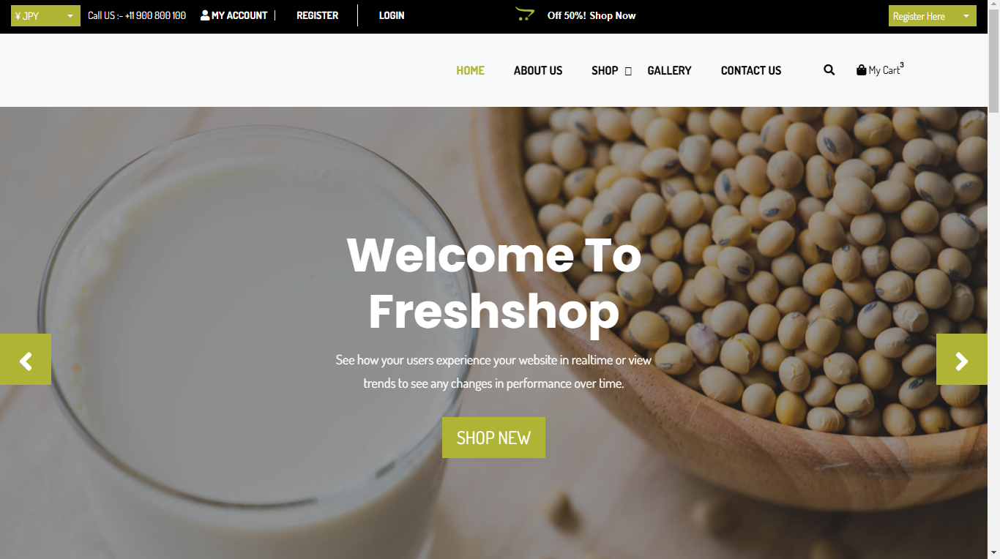

<h1>FreshShop - E-Commerce Website</h1>

FreshShop is an e-commerce platform built with ASP.NET Core MVC and SQL Server that allows users to browse products, add them to their cart, and complete secure purchases. The platform also includes features like product search, user authentication, and an admin panel for inventory management.

<strong>Technologies Used</strong>

<strong>ASP.NET Core MVC:</strong> Web framework for building the platform's user interface and handling business logic.

<strong>SQL Server:</strong> Database management system to store product details, user information, and order records.

<strong>Entity Framework Core:</strong> ORM used to interact with the SQL Server database.

<strong>Features</strong>

<strong>Product Browse &amp; Search:</strong> Users can browse products and search by category or keyword.

<strong>User Authentication:</strong> Users can register, log in, and manage their profiles securely.

<strong>Shopping Cart:</strong> Users can add products to their cart, view their cart, and proceed to checkout.

<strong>Secure Payment:</strong> The checkout process integrates with a secure payment gateway for safe transactions.

<strong>Admin Panel:</strong> Admins can manage the inventory, update product details, and view user orders.

